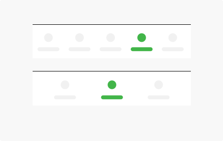
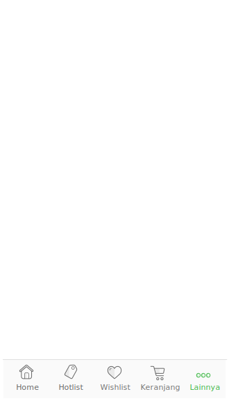

**Bottom Navigation** bars make it easy to explore and switch between top-level views in a single tap.

## Usage

  

    Bottom navigation provides quick navigation between top-level views of an app. It is primarily designed for use on mobile.
      
    Larger displays, like desktop, may achieve a similar effect by using side navigation. For instance, the compact “rail” treatment displays navigational icons by default.
  

  

    
  

## Spec

  

    
    

      
    

  

  

  

  

  

