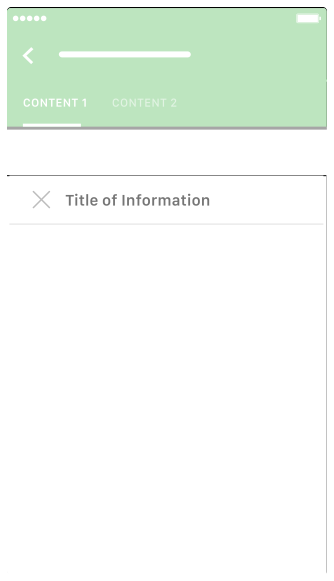
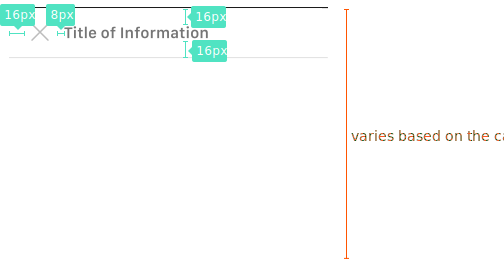

**Bottom Sheets** slide up from the bottom of the screen to reveal more content.

## Usage

  

    Bottom sheets are displayed only as a result of a user-initiated action.
    Modal bottom sheets may:
    Present actions in a list or grid as an alternative to menus or simple dialogs
    Display a contextual menu, when there is no obvious entry point for a menu
    Prioritize the visibility of the elements they contain. Modal bottom sheets can display long menu item names, menu items with subtext, and icons associated with menu items.
      
    When displaying menu items, fully-expanded modal bottom sheets maintain a minimum 8dp distance from the bottom of the app bar.
  

  

    
  

## Type

  

    <b class="display-block mb-16">Normal Bottom Sheets</b>
    
  

  

    <b class="display-block mb-16">Full Page Bottom Sheets</b>
    
  

  

## Spec

  

    
    

      
    

  

  

  

