**Button** express what action will occur when the user clicks or touches it. Buttons are used to initialize an action, either in the background or foreground of an experience.

## Usage

  

    Button are used primarily on action items. Some examples include Add, Save, Delete, Sign up. Do not use Buttons as navigational elements. Instead, use Links because it takes the user to a new page and is not associated with an action. Each page may have one to two primary buttons. Any remaining calls-to-action are represented as secondary buttons.
  

  

    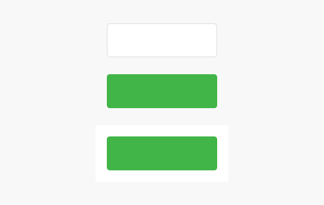
  

## Type

Primary Button

  

    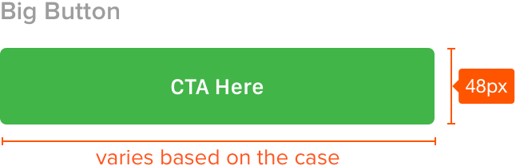
  

  

    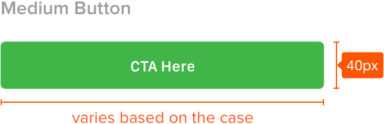
  

  

    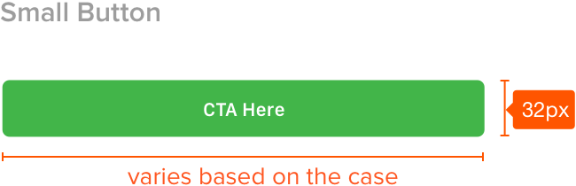
  

Secondary Button

  

    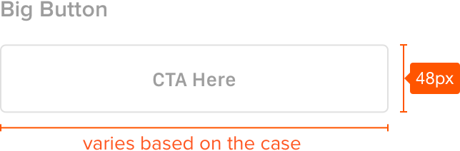
  

  

    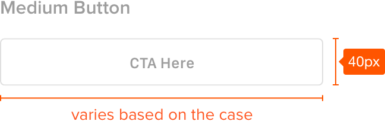
  

  

    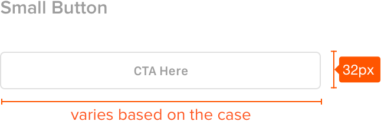
  

Disabled Button

  

    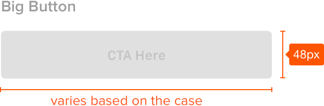
  

  

    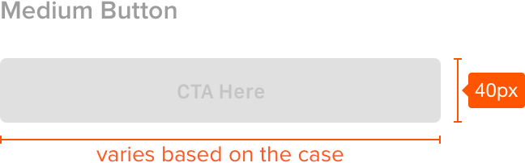
  

  

    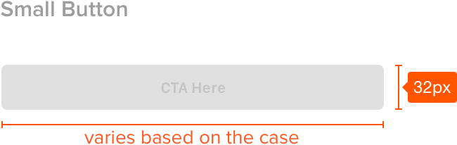
  

Floating Button

  

    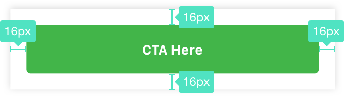
  

  

  

  

  

## Spec

  

    

      
    

  

  

  

