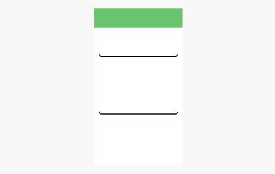
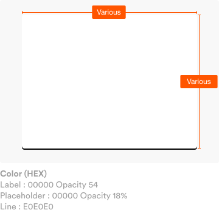
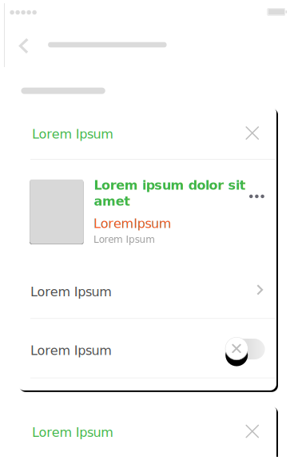

**A card** is a sheet of material that serves as an entry point to more detailed information.

## Usage

  

    Cards may contain a photo, text, and a link about a single subject. They may display content containing elements of varying size, such as photos with captions of variable length. A card collection is a layout of cards on the same plane.
  

  

    
  

## Form & Specs

  

    Cards have a constant width and variable height. The maximum height is limited to the height of the available space on a platform, but it can temporarily expand (for example, to display a comment field).
  

  

    
  

  

    
  

## Use Case Example

  

    Content of Cards depend on every needs of the projects. Card may fill with any other of unify components such as list, text fields, etc.
  

  

    
  

  

  

