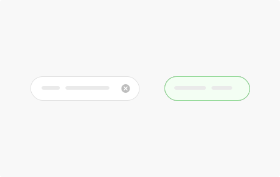
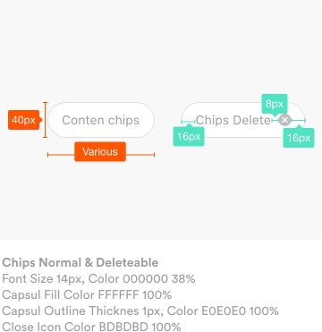
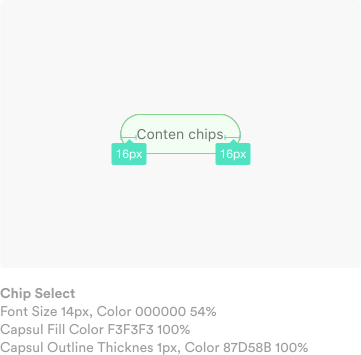
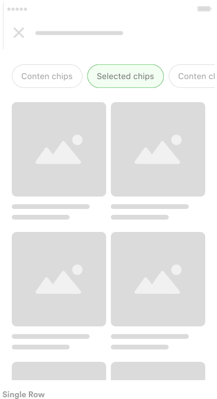
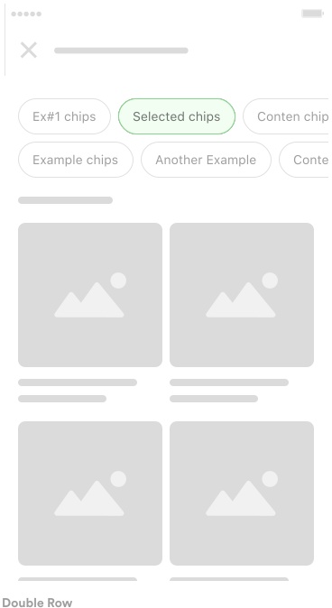

**Chips** represent complex entities in small blocks, such as replied template.

## Usage

  

    Used for various entities, including free form text, predefined text, filter, suggestion and more. There are two types of chips, normal chips and chips that can be deleted.
      
    A chip may contain entities such as text, rules, and an icon.
  

  

    
  

## Behaviour & Specs

  

    Chips can be deleted and selected. Display a delete icon if chip can be deleted. Selected chip display like active mode by showing different state of visual.
      
    Selected chips can not be deleted.
  

  

    
  

  

    
  

## Layout

  

    Chips can be organized up to two rows for the many varying needs. Use a single row for only several chips.
      
    User can slide set of chips for each row
  

  

    
  

  

    
  

