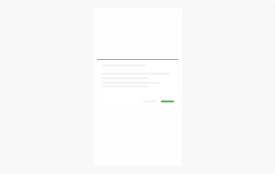
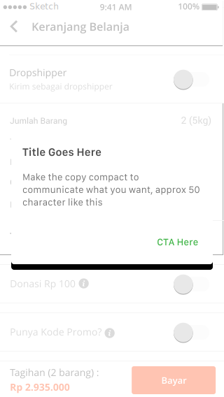
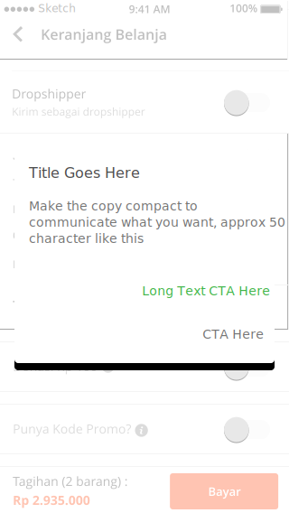
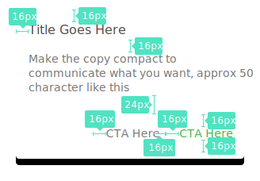

**Dialogs** inform users about a specific task and may contain critical information, require decisions, or involve multiple tasks.

## Usage

  

    Dialogs contain text and UI controls. They retain focus until dismissed or a required action has been taken. Use dialogs sparingly because they are interruptive.
      
    Some dialog types include:
    <ul class="mt-0">
        <li><b>Alerts</b> are urgent interruptions that inform about a situation and require acknowledgement.</li>
        <li><b>Simple menus</b> display options for list items, whereas <b>simple dialogs</b> can provide details or actions about a list item.</li>
        <li><b>Confirmation dialogs</b> require users to explicitly confirm a choice.</li>
    </ul>

  

  

    
  

## Type

  

    <b class="display-block mb-16">Rhetoric Dialog</b>
    
  

  

    <b class="display-block mb-16">Dialog Prominance</b>
    
  

  

    <b class="display-block mb-16">Dialog Prominance Long CTA</b>
    
  

## Spec

  

    
    

      
    

  

  

  

  

  

