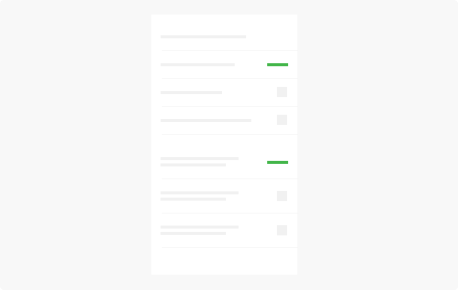
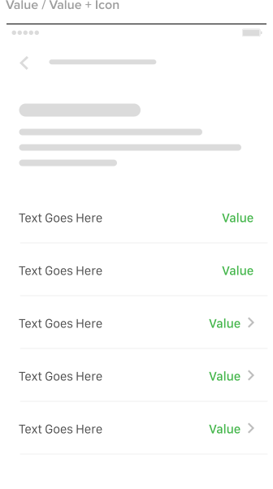
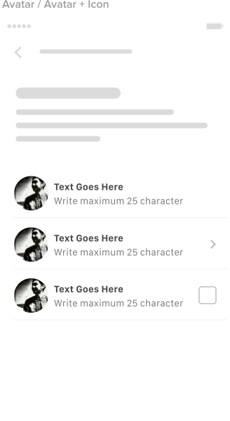
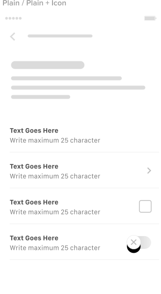
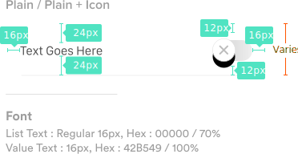
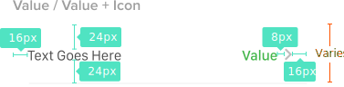
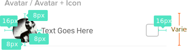
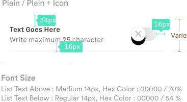
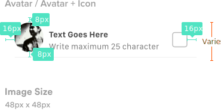

**Lists** consist of related content grouped together and organized vertically

## Usage

  

    A list consists of a single continuous column of tessellated sub-divisions of equal width called rows that function as containers for tiles. Tiles hold content, and can vary in height within a list.
      
    Lists are best suited to presenting a homogeneous data type or sets of data types, such as images and text. They are optimized for reading comprehension while differentiating either between similar data types, or qualities within a single data type.
  

  

    
  

## Type
<b class="display-block">Single Line</b>

  

    
  

  

    
  

  

    
  

<b class="display-block">Two Line</b>

  

    
  

  

    
  

  

## Spec
<b class="display-block">Single Line</b>

  

    
  

  

    
  

  

    
  

<b class="display-block">Two Line</b>

  

    
  

  

    
  

  

