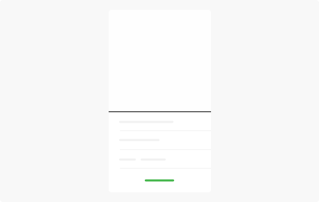

**Menus** display a list of choices on a transient sheet of material.

## Usage

  

  A menu is a temporary piece of material that appears upon interaction with a button, action, pointer, or other control. It contains at least two menu items.
    
  Each menu item consists of a discrete option or action that can affect the app, the view, or selected elements within a view.
    
  Menus should not be used as a primary method for navigation within an app.
  

  

    
  

## Type

  

    Menus with icon 
    
  

  

    Menus Normal 
    
  

  

  

## Spec

  

    
  

  

  

  

  

