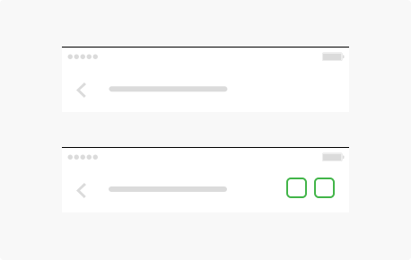

**Navigation Bar** appears at the top of an app screen, below the status bar, and enables navigation through a series of hierarchical screens. 

## Usage

  

    When a new screen is displayed, a back button appears on the left side of the bar. Sometimes, the right side of a navigation bar contains a control, like an Edit or a Done button, for managing the content within the active view.
      
    Consider showing the title of the current view in the navigation bar. In most cases, a title helps people understand what they’re looking at. However, if titling a navigation bar seems redundant, you can leave the title empty.
      
    Use a large title when you need to provide extra emphasis on context. In some apps, the big, bold text of a large title can help orient people as they browse and search. In a tabbed layout, for example, large titles can help clarify the active tab and inform the user when they've scrolled to the top
  

  

    
  

## Type

  

    
  

  

    
  

  

    
  

## Spec

  

    
    

      
    

  

  

  

  

  

