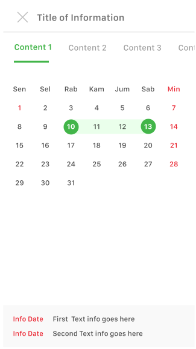
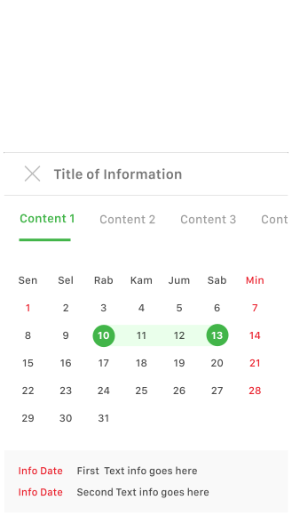

**Pickers** provide a simple way to select a single value from a pre-determined set.

## Usage

  

    Date pickers use a dialog window to select a single date on mobile.
  

  

    
  

## Type

  

    Full Page 
    
  

  

    Half Page 
    
  

  

  

