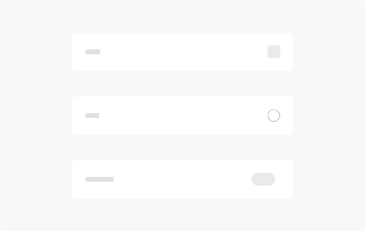
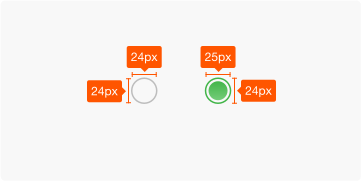
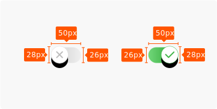

**Selection** controls allow the user to select options.

## Usage

  

    Three types of selection controls are covered in this guidance:
    <ul>
      <li><b>Checkboxes</b> allow the selection of multiple options from a set.</li>
      <li><b>Radio buttons</b> allow the selection of a single option from a set.</li>
      <li><b>Toggle</b> allow a selection to be turned on or off.</li>
    </ul>
  

  

    
  

## Type

  

    <b class="display-block mb-16">Checkbox</b>
    
    
Checkboxes allow the user to select multiple options from a set. If you have multiple options appearing in a list, you can preserve space by using checkboxes instead of on/off switches. If you have a single option, avoid using a checkbox and use an on/off switch instead.

  

  

    <b class="display-block mb-16">Radio Button</b>
    
    
Radio buttons allow the user to select one option from a set. Use radio buttons for exclusive selection if you think that the user needs to see all available options side-by-side. Otherwise, consider a dropdown, which uses less space than displaying all options.

  

  

    <b class="display-block mb-16">Toggle</b>
    
    
On/off toggle the state of a single settings option. The option that the switch controls, as well as the state it’s in, should be made clear from the corresponding inline label. Switches take on the same visual properties of the radio button. The on/off slide toggle with the text “on” and “off” included within the asset is deprecated. Use the switch shown here instead.

  

## Spec

  

    <b class="display-block mb-16">Checkbox</b>
    
  

  

    <b class="display-block mb-16">Radio Button</b>
    
  

  

    <b class="display-block mb-16">Toggle</b>
    
  

