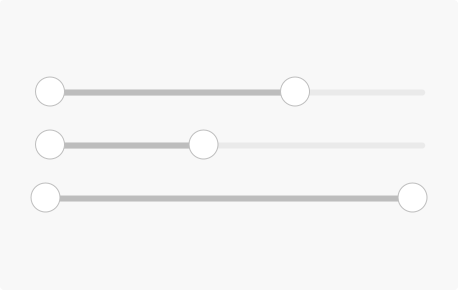
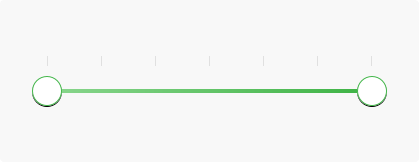

**Sliders** let users select from a range of values by moving the slider thumb.

## Usage

  

    Sliders are ideal components for adjusting settings that reflect intensity levels, such as volume, brightness, or color saturation.
      
    Sliders may have icons on both ends of the bar that reflect the value intensity. Place the smallest value for the slider range on the left and the largest value on the right.
  

  

    
  

## Spec

  

    

      
    

  

  

  

