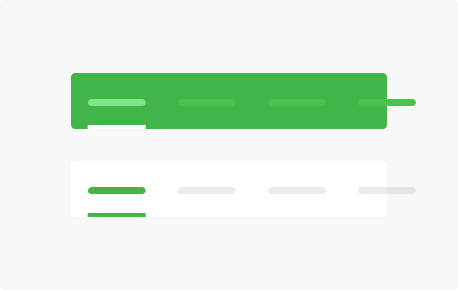
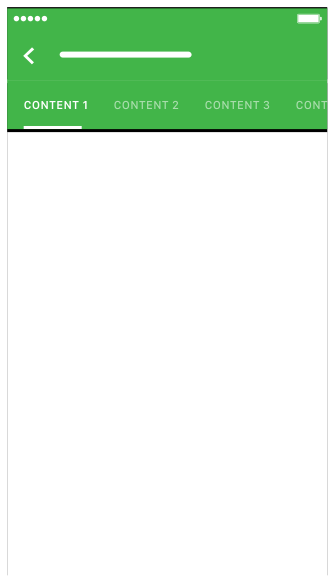
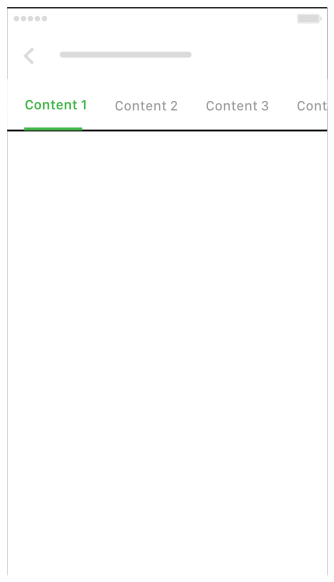
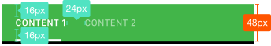

**Tabs** make it easy to explore and switch between different views

## Usage

  

    Tabs enable content organization at a high level, such as switching between views, data sets, or functional aspects of an app.
      
    Present tabs as a single row above their associated content. Tab labels should succinctly describe the content within.
      
    Because swipe gestures are used for navigating between tabs, don't pair tabs with content that also supports swiping.
    

      
    

  

  

    
  

## Type

  

    Main Tab 
    
  

  

    Main Tab - Many Item 
    
  

  

    Secondary Tab 
    
  

## Spec

  

    
  

  

  

  

  

