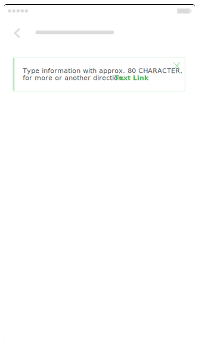
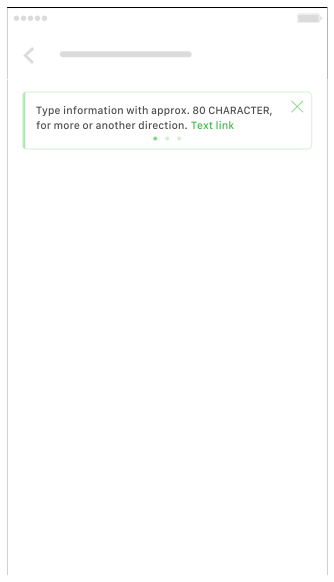
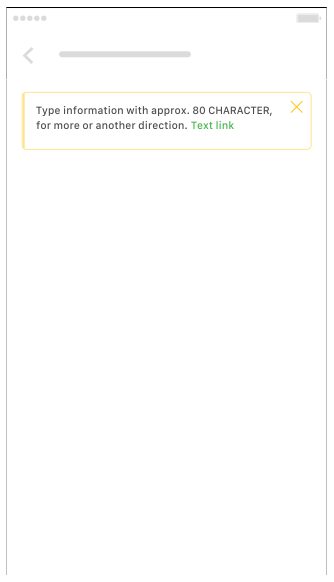
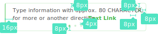

**Tickers** provide short, timely, and relevant information about important things that will happen in our system

## Usage

  

    Tickers are intended to inform users about important things in your app and have been designed to make it easy to scan.
  

  

    
  

## Type

  

    Announcement Ticker 
    
  

  

    Announcement Sliding Ticker 
    
  

  

    Warning Ticker 
    
  

## Spec

  

    
    

      
    

  

  

  

  

  

