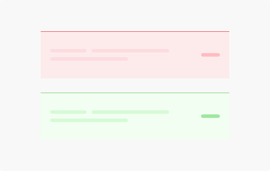
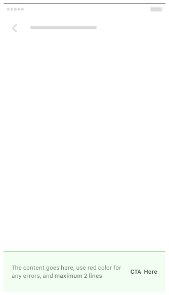
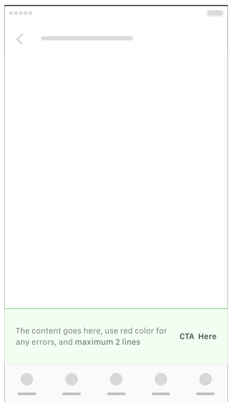
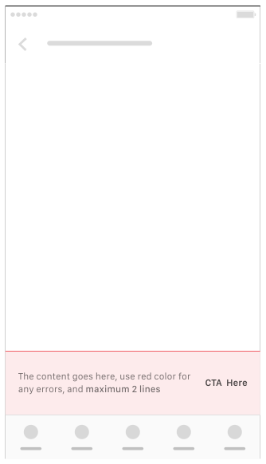
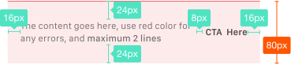

**Toaster** provides brief feedback about an operation through a message at the bottom of the screen.

## Usage

  

    Toasts contain a single line of text directly related to the operation performed. They may contain a text action, but no icons.
       
    Only one toast may be displayed at a time. Each toast may contain a single action, and animate upwards from the bottom edge of the screen or bottom nav. Toaster be automatically time out from the screen depends on the case.
    

      
    

  

  

    
  

## Type

  

    Toaster Normal 
    
  

  

    Toaster - Bottom Nav 
    
  

  

    Toaster Error 
    
  

## Spec

  

    
  

  

  

  

  

