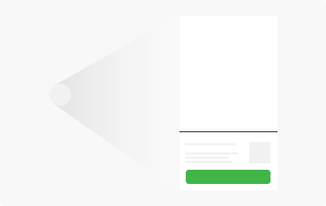
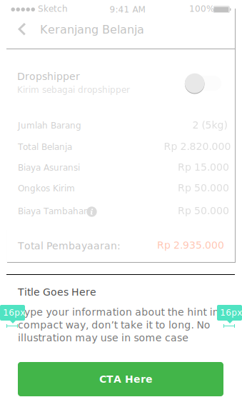

**Tooltips** provide additional information upon hover, focus, or click. They often contain helper text that is contextual to an element.

## Usage

  

  It is usually used as an interactive icon beside the short text, representing rich information that shows like a bottom sheet trigerred by clicked icon.
  

  

    
  

## Type & Spec

  

    Illustration Helper 
    
  

  

    Text Only 
    
  

  

  

