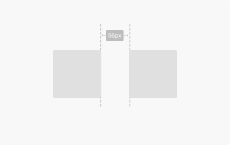

All components align to an 8dp square baseline grid for mobile, tablet, and desktop.

## Usage

  

    Use multiples of 8 to define dimensions, padding, and margin of both block and inline elements.
      
    When the only contents of a block element are text (e.g. buttons), set the text to a size consistent with the rest of your UI and/or the specific platform, then use padding to determine the size of the block element. In cases of a full-width element, use padding to determine height and a consistent horizontal margin to determine width.
  

  

    
  

## Type

  

    

      
    

  

